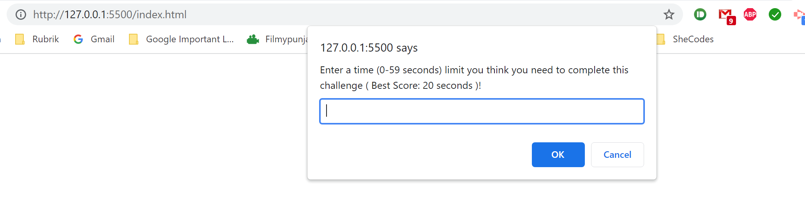
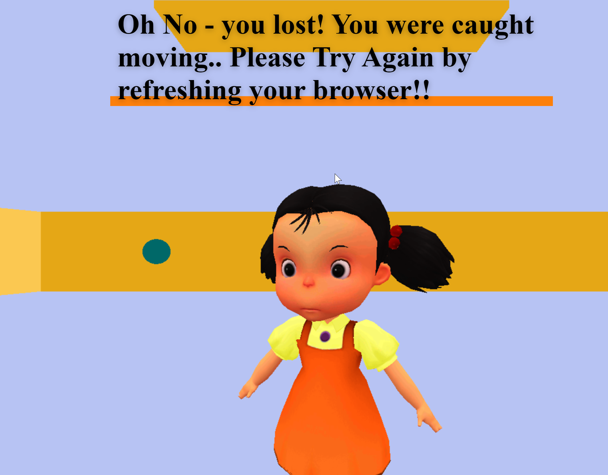
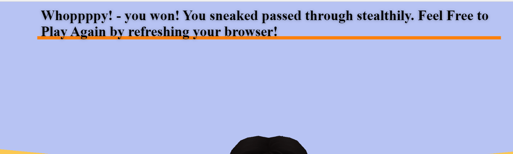

# SquidGame_3js

Practicing JS and 3js to build a SquidGame inspired red light/green light **game that allows a player to stealthily sneak past the prying eyes of a watchful Doll!**

## [GAME URL](https://dionnenoellabarretto.github.io/SquidGame_3js/)

### [Tutoring Credits](https://dev.to/0shuvo0/i-made-squid-game-with-javascript-10j9)

### Game Screenshots

